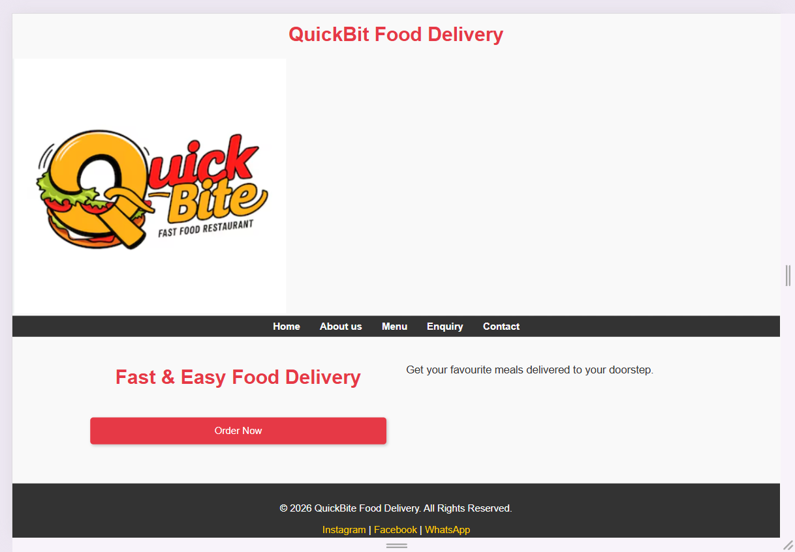
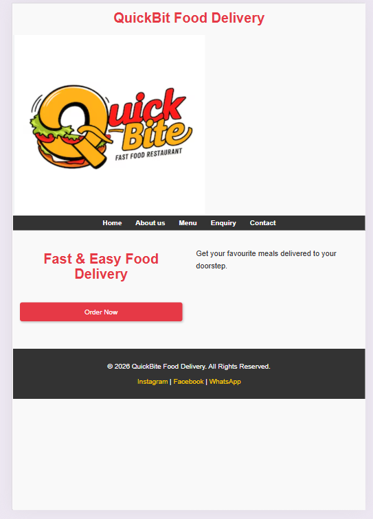
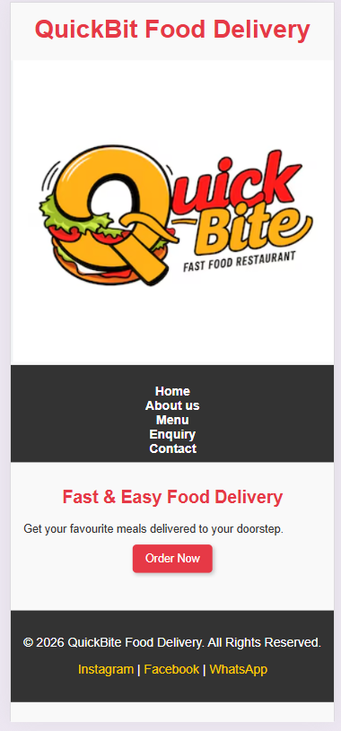

# Project Title
QuickBite Food Delivery

## Student Information
**Student number:** ST10513367  
**Student Name:** Buhle Michelle Nyathi

## Project Overview

NAME: QUICKBITE FOOD DELIVERY
TYPE OF BUSINESS: SMALL BUSINESS (FOOD AND DELIVERY SERVICE)

Description:
QuickBite Food Delivery is a local business that delivers fast food to customers in Pretoria. It partners with small restaurants to produce quick, low-cost meals, focusing on students and busy workers.

Mission Statement:
To deliver fast, affordable, and reliable food services that satisfy customers anytime and anywhere.

Vision Statement:
To become the leading local food delivery business known for convenience and one of the top food delivery services in South Africa.

Target Audience:
•	Students
•	Busy families
•	Office workers
•	People who love fast food

## Website Goals and Objectives

       Goals:
•	Make it easier for customers to place and track orders.
•	Provide an accessible ordering system
•	Increase brand awareness

      Objectives:
•	Show food menus from different restaurants
•	Enable online ordering and checkout
•	Promote discounts and specials
•	Provide delivery tracking information

      Key Performance Indicators:
•	Website traffic: 900+ visitors /month
•	Number of placed orders: 300+ orders/month
•	Retention rate of customers: 70% returning customers
•	Average order value: R150 per order

## Timeline and Milestones

TASK	                 DURATION	 DATE
RESEARCH AND PLANNING	1 Week	2 – 8 May
WIREFRAMES & DESIGN	1 Week	9 - 15 May
WEBSITE DEVELOPMENT	2 Weeks	16 – 29 May
TESTING & DEBUGGING	1 Week	30 May – 5 June
DEPLOYMENT	            2 Days	6 – 7 June
FINAL DOCUMENTATION &
SUBMISSION	            2 Days	8 – 9 June

## Sitemap

   ( )

## Screenshots of homepage on desktop, tablet, and mobile:

 
  
 

## References

Ensure that all sources used in your assignment are cited and referenced using the Harvard referencing style.

Uber Eats (2026) Uber Eats South Africa. Available at:
http://www.ubereats.com/za (Accessed: 10 April 2026).

Bolt Food (2026) Bolt Food South Africa. Available at:
http://food.bolt.eu (Accessed: 10 April 2026).

Interaction Design Foundation (2024) User Experience (UX) Design Basics. Available at:
http://www.interaction-design.org (Accessed: 11 April 2026)

draw.io (2026) draw.io Diagramming Tool. Available at:
https://app.diagrams.net (Accessed:18 April 2026)

W3Schools (2026) *Responsive Web Design*. Available at: 
https://www.w3schools.com/css/css_rwd_intro.asp (Accessed: 28 May 2026)

MDN Web Docs (2026) *CSS Grid Layout*. Available at: 
https://developer.mozilla.org/en-US/docs/Web/CSS/CSS_Grid_Layout (Accessed: 28 May 2026)
