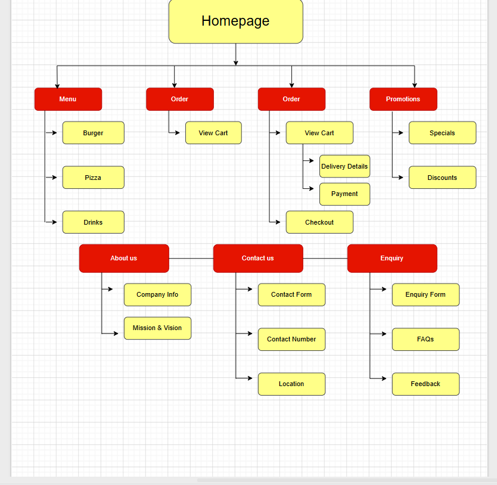

# Project Title
QuickBite Food Delivery

## Student Information
**Student number:** ST10513367  
**Student Name:** Buhle Michelle Nyathi

## Project Overview

NAME: QUICKBITE FOOD DELIVERY
TYPE OF BUSINESS: SMALL BUSINESS (FOOD AND DELIVERY SERVICE)

Description:
QuickBite Food Delivery is a local business that delivers fast food to customers in Pretoria. It partners with small restaurants to produce quick, low-cost meals, focusing on students and busy workers.

Mission Statement:
To deliver fast, affordable, and reliable food services that satisfy customers anytime and anywhere.

Target Audience:
•	Students
•	Busy families
•	Office workers
•	People who love fast food

## Website Goals and Objectives

       Goals:
•	To allow customers to order food online 
•	Provide an accessible ordering system
•	Increase brand awareness

      Objectives:
•	Show food menus from different restaurants
•	Enable online ordering and checkout
•	Promote discounts and specials
•	Provide delivery tracking information

      Key Performance Indicators:
•	Website traffic
•	Number of placed orders
•	Retention rate of customers
•	Average order value

## Timeline and Milestones

TASK	                TIME
RESEARCH AND PLANNING	1 Week
DESIGN	                1 Week
DEVELOPMENT         	2 Weeks
TESTING              	1 Week
FINAL SUBMISSION     	1 Week

## Sitemap

   (

## References

Ensure that all sources used in your assignment are cited and referenced using the Harvard referencing style.
